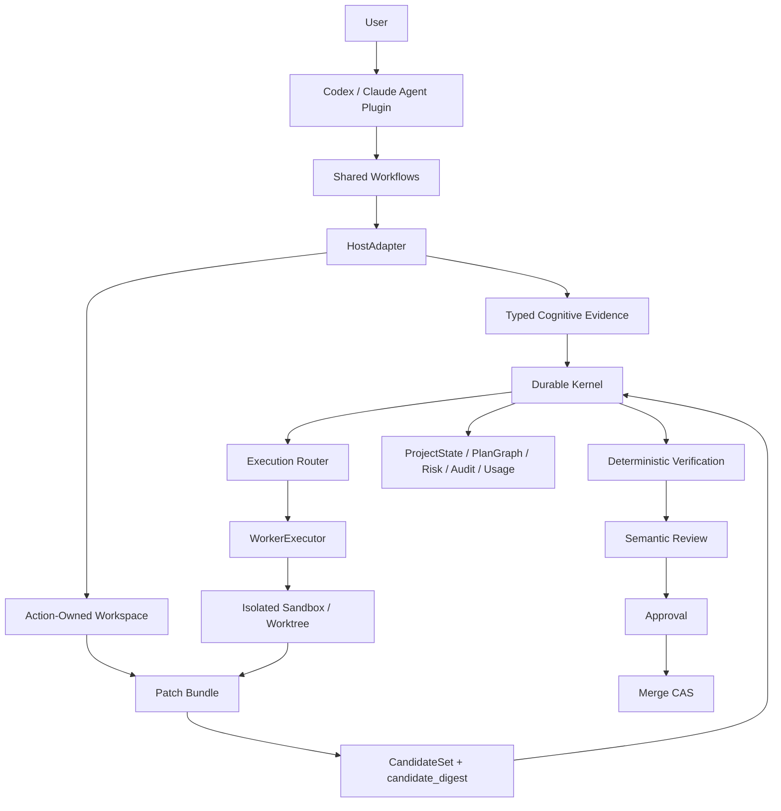

# Apex Forge V2

[](https://github.com/d-wwei/apex-forge-v2/releases)
[](./planning/plugin-upgrade-execution-status.md)
[](./benchmarks/plugin-vs-v1/latest-evaluation.json)
[](./planning/plugin-upgrade-execution-status.md)
[](./LICENSE)

**Agent Plugin 负责自然语言协作，Durable Kernel 负责状态、证据和交付真相。**

Apex Forge V2 是一个面向 coding Agent 的软件研发交付系统。它把需求、实现、
验证、评审、审批、恢复和发布组织成可持久化、可审计、可恢复的项目级工作流，
而不是一次性的 prompt 或固定流水线。

当前版本以 Codex Agent Plugin 为主要入口，同时提供 Claude Code 插件包、
platform-neutral Kernel、capability-based WorkerExecutor 和可选 Factory Mode。

> Latest prerelease: [`v0.2.0-rc.1`](https://github.com/d-wwei/apex-forge-v2/releases/tag/v0.2.0-rc.1)
> Verified Candidate:
> `45c1d36d2ca1225725d97f93c33a68819845b756d7083ac14fa9ac82e1abc9c6`

## 为什么需要 Apex Forge

普通 Agent coding 容易遇到这些问题：

- Agent 说“完成了”，但测试、review、learn 或 durable run 仍未关闭；
- 验证跑在旧工作区，实际 patch 没有被物化；
- 多个 Agent 并发写同一仓库，状态和证据互相覆盖；
- 进程异常退出后留下 daemon、锁、临时工作区或半写状态；
- verification、approval 和 merge 绑定的不是同一份代码；
- README、聊天记录或 exit code 被误当成发布证据；
- 长任务中断后只能重新开始，无法基于同一 objective 恢复。

Apex Forge 的基本立场是：

> Claim 弱于 Artifact。
>
> 测试通过弱于 Candidate-bound Verification。
>
> Agent 最终消息弱于 Durable Kernel Closure。

## 核心架构



### 系统不变量

| 不变量 | 约束 |
|---|---|
| Kernel 是唯一事实源 | Plugin、Skill、HostAdapter、WorkerExecutor 不拥有第二份 ProjectState |
| Claim 弱于 Artifact | 文本声明不能直接证明完成 |
| 修改必须有所有权 | Interactive patch 只能发生在 action-owned workspace |
| Candidate 不可变 | verification、review、approval、merge 必须绑定同一 digest |
| 状态迁移 crash-safe | WAL、revision CAS、lease、fencing、idempotency 共同工作 |
| Gate fail closed | 缺证据、证据漂移、candidate 变化、provenance 缺失都阻断发布 |
| 平台适配是薄层 | Host identity 和 UX 不进入 Kernel semantics |

## 产品模式

| Mode | 适用场景 | 执行位置 |
|---|---|---|
| Interactive Cognitive | context、risk、design、review、status | 当前 Host Agent |
| Interactive Patch | 普通低风险实现 | ActionWorkspace |
| Factory | 长任务、并行、后台、可恢复执行 | Isolated sandbox/worktree |
| Operator | reconcile、诊断、迁移、发布 | 显式 CLI |

正常用户路径不要求输入原始 Kernel CLI。CLI 是 operator/debug surface，不是主要
产品入口。

## 已实现能力

### 项目级研发循环

- `.apex-v2/` durable project state、events、artifacts、knowledge 和 risks；
- intake、triage、roadmap、task-aware PlanGraph；
- context、risk、design、implementation、tests、verification、review、integrate、learn；
- quick route 与 full route；
- partial pass、carry-forward、human acceptance 和 Risk Register；
- project metrics、quality policy、notifications 和 adapter history。

### 工作区与 Candidate 安全

- ActionWorkspace 基线、scope 和并发修改检测；
- secret、binary、symlink、delete、out-of-scope 变化阻断；
- ordered patch operations 与 operation-level conflict detection；
- immutable CandidateSet 和 content-addressed `candidate_digest`；
- candidate mutation、TOCTOU 和 merge CAS 防护。

### Durable Kernel

- transaction journal、原子 JSON 和 event append；
- project lock、revision CAS、lease、fencing、idempotency；
- SIGKILL、stale lock、orphan workspace 和 started transaction recovery；
- event replay、operational state hash 和 reconcile；
- schema migration 与 contract authority。

### Agent 与执行器

- typed cognitive evidence 和 semantic claim checks；
- HostAdapter / WorkerExecutor / ModelProvider 分层；
- Codex、Claude、Gemini 和 generic OpenAI-compatible runner；
- capability-based routing、retry、resume、fallback 和 cancellation；
- session-bound usage、wall time、attempt 和 tool evidence。

### 资源保护

- TERM 到 KILL 的完整进程树回收；
- detached daemon 和 guard-token orphan 检测；
- 磁盘低水位、磁盘增长、workspace 增长和输出上限熔断；
- 父进程消失和 runner orphan fail-closed；
- workspace 并发文件 churn 不会误触发 `ENOENT` 磁盘故障。

## 快速开始

### 环境要求

- Node.js 22 或更高版本；
- npm；
- Codex CLI 或 Claude Code；
- Git。

### 从源码安装 Codex Plugin

```bash
git clone https://github.com/d-wwei/apex-forge-v2.git
cd apex-forge-v2

npm ci
npm run build:plugin

codex plugin marketplace add .
codex plugin add apex-forge-v2@apex-forge-local
```

安装后新建一个 Codex 任务，使最新版 Skills 被重新加载。

### 从 Release 资产安装

从
[`v0.2.0-rc.1`](https://github.com/d-wwei/apex-forge-v2/releases/tag/v0.2.0-rc.1)
下载：

- `apex-forge-v2-codex-0.2.0-rc.1.tar.gz`
- `SHA256SUMS`

校验：

```bash
shasum -a 256 -c SHA256SUMS
```

将插件包解压到本地 marketplace 后，通过 `codex plugin add` 安装。

### 安装 Claude Code Plugin

```bash
git clone https://github.com/d-wwei/apex-forge-v2.git
cd apex-forge-v2

npm ci
npm run build:plugin

claude plugin marketplace add ./plugins/claude-code
claude plugin install apex-forge-v2@apex-forge-local --scope user
```

## 如何使用

直接用自然语言描述目标：

```text
用 Apex Forge 实现这个需求：
给导入 worker 增加有上限的重试，并补充回归测试。
```

```text
继续上次中断的 Apex Forge 任务。
```

```text
审查当前 Candidate，重点检查安全、回滚和残余风险。
```

```text
告诉我当前 Apex Forge 状态、阻塞项和待审批事项。
```

Plugin 提供六个共享工作流：

| Skill | 用途 |
|---|---|
| `using-apex-forge` | 入口和路由 |
| `apex-forge-plan` | intake、风险、设计和 PlanGraph |
| `apex-forge-execute` | Interactive/Factory 执行 |
| `apex-forge-review` | Candidate-bound semantic review |
| `apex-forge-ship` | approval、merge、learn 和 durable closeout |
| `apex-forge-status` | 状态、恢复、风险和待办 |

## Operator CLI

CLI 用于管理、诊断和发布：

```bash
# 初始化或查看项目
node src/apex-v2.mjs init --project . --name "My Project"
node src/apex-v2.mjs status --project .

# 校验和 reconcile
npm run validate
npm run check:schemas
node src/apex-v2.mjs project reconcile --project . --apply

# 查看 Host actions
node src/apex-v2.mjs host actions --project . --host-id codex-host

# 生成和验证 Release Candidate
npm run release:candidate
npm run release:validate-candidate

# 执行完整发布 Gate
npm run release:verify
```

## 已验证的发布证据

`v0.2.0-rc.1` 通过：

| Gate | 结果 |
|---|---:|
| Automated tests | `263/263 PASS` |
| Schemas | `55` |
| Contract validations | `1,256 PASS` |
| Project reconcile | `CONSISTENT` |
| Dependency audit | `0 vulnerabilities` |
| Product Benchmark | `90/90 completed` |
| Release verification | `16/16 PASS` |
| Candidate validators | Codex + Claude PASS |
| Native lifecycle | install/update/rollback/uninstall PASS |

Product Benchmark 包含：

- 5 个真实仓库；
- 6 类场景：simple、multi-step、bug-fix、interrupted、review-defect、parallel；
- 3 种模式：Apex Forge V1、CLI Kernel、Agent Plugin；
- 每种模式 30 条 official runs；
- hidden acceptance、provenance、唯一性和环境一致性 Gate。

### Benchmark 结果

| Metric | V1 Skill | CLI Kernel | Plugin Kernel |
|---|---:|---:|---:|
| Completion | 1.000 | 1.000 | 1.000 |
| Recovery | 1.000 | 1.000 | 1.000 |
| Safety | 0.967 | 1.000 | 1.000 |
| Hidden acceptance | 1.000 | 1.000 | 1.000 |
| Evidence | 0.733 | 0.850 | **1.000** |
| Durable closure | 0.000 | 0.700 | **1.000** |
| False completion | 0 | 0 | 0 |

Product Gate 的 absolute、relative 和 durable-value Gate 全部通过。

完整证据：

- [`planning/plugin-upgrade-execution-status.md`](./planning/plugin-upgrade-execution-status.md)
- [`benchmarks/plugin-vs-v1/latest-evaluation.json`](./benchmarks/plugin-vs-v1/latest-evaluation.json)
- [`benchmarks/plugin-vs-v1/results-manifest.json`](./benchmarks/plugin-vs-v1/results-manifest.json)
- [`docs/releases/v0.2.0-rc.1.md`](./docs/releases/v0.2.0-rc.1.md)

## 仓库结构

```text
src/
  commands/       CLI domain commands
  core/           Kernel、state、transactions、candidate、policy
  benchmark/      controller、runner、evaluator、provenance
  executors/      WorkerExecutor implementations
  hosts/          HostAdapter implementations
  providers/      ModelProvider boundary
  release/        Candidate bundle and verification

schemas/          JSON Schema contracts
workflows/        Platform-neutral shared Skills
plugins/          Codex and Claude Code packages
benchmarks/       Product Benchmark tasks and official evidence
planning/         Architecture and upgrade plan
tests/            Unit, integration, adversarial and lifecycle tests
```

## 开发与验证

```bash
npm ci

# 全量测试
npm test

# Kernel 和 contracts
npm run validate
npm run check:schemas

# 插件
npm run build:plugin
npm run validate:plugins

# Benchmark 输入
npm run benchmark:validate-tasks
npm run benchmark:preflight

# Product Gate
npm run benchmark:plugin

# Release Gate
npm run release:verify
```

## 发布完整性

Release 资产包含：

- Codex 和 Claude Code 插件包；
- verified Candidate source archive；
- Candidate manifest；
- 90-run benchmark result archive 和 manifest；
- Product evaluation；
- Release verification；
- final acceptance audit；
- SHA-256 checksums。

Plugin 包内包含 runtime hash、schema hash、source tree hash、SBOM、LICENSE、
THIRD_PARTY_NOTICES 和 provenance。

## 当前边界

- `v0.2.0-rc.1` 是 prerelease，不是长期支持版本；
- 复杂 multi-step、interrupted、review-defect 和 parallel 场景的 wall time 与
  token cost 高于 V1；
- DeepSeek 当前只验证 generic ModelProvider / WorkerExecutor fixture，不宣称
  live endpoint 已验证；
- MCP 保持 deferred，直到出现真实的 remote control 或跨机器协调需求；
- CLI 是 operator surface，普通用户优先使用 Agent Plugin。

## Contributing

提交变更前至少运行：

```bash
npm test
npm run validate
npm run check:schemas
```

涉及 workspace、candidate、transaction、benchmark evaluator 或 release 的变更，
必须增加 failure-path 或 adversarial regression，不能只覆盖 happy path。

## Security

如果发现 secret 泄漏、path escape、权限绕过、candidate drift、错误 merge、
orphan process 或 release provenance 问题，请不要公开利用细节，优先通过 GitHub
Security Advisory 或私下渠道报告。

## License

[MIT](./LICENSE)

第三方依赖与许可证见
[`THIRD_PARTY_NOTICES`](./THIRD_PARTY_NOTICES)。
