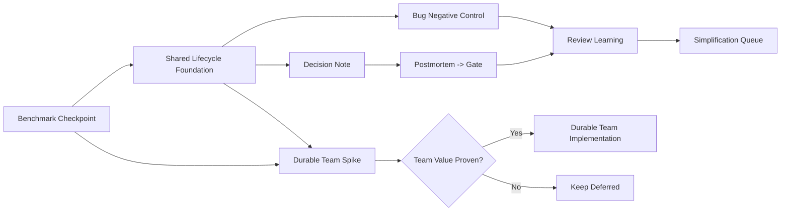

# Apex Forge V2 DSH 能力后续补充计划 V1

- 日期：2026-08-25
- 基线版本：`v0.2.0-rc.1+codex.20260824153545`
- 基线提交：`ce8ca6a`
- 基线 Candidate：
  `72a8dad710edb47b682fb51715625e85494370786346ba733bafa1dfacdafbd7`
- 状态：`READY_FOR_EXECUTION_AFTER_BENCHMARK_CHECKPOINT`
- 范围：仅 Apex Forge 软件研发 Loop/Graph
- 不包含：Product Graph、Test Graph、DSH Cordis 源码或 private Agent Teams API

## 1. 一句话目标

把目前已有的 DSH 原子能力、证据协议和治理原则，补成真正可恢复、可审计、
不可绕过的研发状态机；同时确保这些能力只在匹配场景触发，不重新把治理塞回每个
任务的热路径。

## 2. 当前事实

当前 Apex Forge 已具备：

- 三 Barrier Governed 执行模型；
- Quick、Disciplined、Phase Context、Governed Method Pack；
- PlanGraph、Worker、Artifact、Event、Approval、Risk、Learning；
- ActionWorkspace、Candidate Digest、Verification、Review、Merge；
- Factory scheduler、worker lease/fencing、局部失败恢复；
- typed capability registry 和 21 项原子 capability；
- `tdd-negative-control`、`postmortem`、`simplification` 的 request/evidence
  contract。

但以下六项仍未形成完整产品能力：

| 能力 | 已有基础 | 当前缺口 |
| --- | --- | --- |
| Bug Negative Control | capability、typed evidence、TDD protocol | Bug 强制触发、RED signature、waiver、Review/Ship Gate |
| Decision Note | decision Artifact、Approval、Candidate | 生命周期、supersession、implemented binding、查询 UX |
| Postmortem -> Gate | postmortem evidence、Risk、Learning | incident 生命周期、control routing、verified closure |
| Review Learning | Review finding、Learning queue、Approval | adopted-human lineage、规则候选、promotion/rollback |
| Simplification Queue | simplification evidence、Cost Governor | scanner、typed queue、执行与收益验证 |
| Durable Team | PlanGraph、Worker、scheduler、lease/fencing | roster、mailbox、assignment、ack、recovery |

当前源码中不存在这些完整领域对象：

- `decision-note.schema.json`
- `postmortem.schema.json`
- `simplification-queue.schema.json`
- `team-roster.schema.json`
- `team-mailbox.schema.json`
- `review-rule.schema.json`

因此不能把“原子 capability 已存在”描述成“完整生命周期已落地”。

## 3. 核心决策

### 3.1 不六项齐头并进

优先解决能直接提高交付质量、且不会显著增加所有任务成本的能力：

```text
Negative Control
    -> Decision Note
    -> Postmortem + Review Learning
    -> Simplification Queue
    -> Durable Team（条件触发）
```

### 3.2 Durable Team 最后做

当前 scheduler 已经提供：

- 多 Worker 并行；
- dependency unlock；
- lease/fencing；
- 局部 retry/fallback；
- worktree/sandbox；
- durable result。

因此 Team 的新增价值只剩：

- 稳定角色；
- assignment lineage；
- mailbox/ack；
- 跨重启团队恢复。

如果效果测试不能证明这些需求真实存在，则不进入实现阶段。

### 3.3 新能力默认 Shadow

所有新能力先按以下顺序启用：

```text
schema/read-only projection
-> shadow writer
-> audit-only Gate
-> scoped enforce
-> default enforce
```

不得在同一版本中同时新增状态机并默认强制全部任务执行。

### 3.4 继续坚持单一事实源

- 生命周期事实继续写入 `.apex-v2/events.jsonl`。
- 正文和证据继续使用 immutable Artifact。
- ProjectState 只保存根级 projection。
- Team assignment 继续引用 PlanGraph 和 Worker。
- 权限继续使用现有 Approval。
- 未闭合问题继续进入 Risk。
- 规则候选继续进入 Learning。

禁止新增第二套：

- Event Log；
- ProjectState；
- Task DAG；
- Worker lifecycle；
- Approval store；
- Learning pipeline。

## 4. 实施路线



## 5. Stage 0：效果测试检查点

三个独立 Pilot 负责给后续能力设成本边界：

1. Quick/Disciplined 性价比；
2. Governed 并行吞吐；
3. 当前 Candidate 质量与成本独立审计。

进入默认 enforce 前必须得到：

- 当前 Candidate、任务、模型、Provider、环境可比；
- token/tool/turn usage 完整；
- hidden acceptance 和 durable closure 不下降；
- simple task median wall-time overhead 不高于 15%；
- 新能力增加的默认 prompt/context 有明确预算。

Pilot 未完成时允许：

- 写 contract；
- 写 reader；
- 写 shadow projection；
- 写 adversarial test。

Pilot 未完成时禁止：

- 全局默认开启新 Gate；
- 新增所有任务必经节点；
- 宣称成本目标达成。

## 6. Stage 1：Bug 强制 Negative Control

### 6.1 目标

新建、重开或进入修复流程的 Bug，必须证明：

```text
错误行为可复现
-> RED 的失败签名正确
-> 修复后 GREEN
-> 恢复/清理完成
```

### 6.2 复用

- `tdd-negative-control` capability；
- PlanGraph capability binding；
- ActionWorkspace；
- Candidate Digest；
- Verification；
- Approval 和 Risk。

### 6.3 最小新增

新增 `negative-control-record.schema.json`：

```text
record_id
run_id
plan_node_id
candidate_digest
status: required|red_verified|green_verified|restored|waived
fault_model
red_command
expected_failure_signature
observed_failure_signature
green_command
restoration_evidence_refs
waiver_approval_id
```

持久路径：

```text
.apex-v2/runs/<run_id>/negative-control.json
```

### 6.4 路由

- Intake type 为 `bug` 时自动 required。
- Quick 仍不新增独立认知节点，绑定到 implementation。
- Disciplined/Governed 绑定 implementation + verification。
- 非 Bug 不触发。

### 6.5 Gate

- RED 未失败：BLOCK。
- RED 失败签名不匹配：BLOCK。
- GREEN 使用不同测试入口且无解释：BLOCK。
- mutation/fixture 未恢复：BLOCK。
- waiver 缺 Risk + Approval + candidate binding：BLOCK。

### 6.6 DoD

- 新 Bug verified 或有效 waiver：100%。
- wrong-signature RED 通过数：0。
- false completion：0。
- Quick 非 Bug 节点数不增加。

## 7. Stage 2：Decision Note 生命周期

### 7.1 触发

只在以下情况要求 Decision：

- public API/schema 兼容性；
- security/auth/permission；
- 数据迁移；
- 不可逆副作用；
- 两个以上可行架构方案且影响长期维护；
- 人工明确要求记录。

### 7.2 状态机

```text
proposed
-> accepted | rejected
accepted
-> implemented | superseded
implemented
-> archived
```

禁止：

- Worker 自己接受自己的 Decision；
- `implemented` 缺 Candidate + Verification；
- archive 后修改正文；
- 新 Decision 静默覆盖旧 Decision。

### 7.3 数据模型

新增 `decision-note.schema.json`：

```text
decision_id
revision
status
title
scope
options
decision_artifact_id
decision_artifact_hash
accepted_by
accepted_at
approval_id
supersedes
superseded_by
implementation_refs
candidate_digest
verification_refs
created_at
updated_at
last_event_id
```

正文放 Artifact，Decision 对象只保存状态和引用。

### 7.4 CLI/Plugin

Kernel operation：

```text
decision create
decision show
decision accept
decision reject
decision implement
decision supersede
decision archive
decision pending
```

Plugin 复用相同 operation，不创建独立状态。

### 7.5 DoD

- 非法迁移拒绝率：100%。
- accepted/implemented lineage 完整率：100%。
- implemented 绑定 Candidate/Verification：100%。
- archive Artifact hash 漂移：0。

## 8. Stage 3：Postmortem -> Gate

### 8.1 目标

事故复盘不止产生总结，而是产生可验证 control proposal：

```text
incident
-> investigation
-> control proposals
-> Risk/Learning
-> Approval
-> implementation
-> verification
-> close
```

### 8.2 数据模型

新增 `postmortem.schema.json`：

```text
postmortem_id
severity
status: opened|investigating|controls_proposed|verifying|closed|risk_accepted
incident_artifact_id
timeline_artifact_id
root_cause_artifact_id
risk_ids
control_proposal_ids
owner
source_run_ids
approval_id
verification_refs
last_event_id
```

### 8.3 路由规则

| Control 类型 | 目标 |
| --- | --- |
| 新测试/Negative Control | PlanGraph + Negative Control |
| 新权限/deny rule | Gate Policy proposal |
| 新风险项 | Risk Register |
| 新研发规则 | Learning proposal |
| 重复复杂度 | Simplification candidate |

自动路由只能创建 proposal，不能自动启用 Gate 或接受 Risk。

### 8.4 DoD

- high/critical Postmortem 无 verified control 不可 close。
- risk acceptance 必须有 Approval 和 expiry。
- control 在错误实现上不失败时保持 BLOCKED。
- Postmortem 关闭不等于 control 已实现。

## 9. Stage 4：Review Learning

### 9.1 输入边界

只有以下 finding 可进入规则候选：

- `author_type=human`；
- finding 被明确采纳；
- 修复后 Candidate Digest 已变化；
- Verification 证明问题关闭；
- finding 不是纯样式意见。

Agent 自己提出、自己采纳、自己推广的闭环禁止进入全局规则。

### 9.2 扩展现有 Learning

扩展 `learning-proposal.schema.json`：

```text
proposal_type: review_rule|postmortem_control|general_learning
source_review_finding_ids
source_postmortem_ids
author_type
adopted_by
candidate_before
candidate_after
scope: project|repository|global
promotion_status
rollback_refs
```

复用当前：

- Learning apply job；
- Approval；
- receipt；
- knowledge version；
- `learning.applied` Event。

### 9.3 Promotion

- project rule：一名人工 Approval。
- repository rule：一名 owner + 一名 reviewer。
- global rule：双 reviewer + 人工 Approval。
- 自动 promotion：禁止。

### 9.4 DoD

- 非人工或未采纳 finding 进入候选数：0。
- Candidate 未变化却标记 adopted：0。
- promotion provenance 完整率：100%。
- rollback 可恢复上一 knowledge version。

## 10. Stage 5：Simplification Queue

### 10.1 原则

Simplification 是后台候选生成器，不是自动删代码 Agent。

### 10.2 数据模型

新增 `simplification-queue.schema.json`：

```text
simplification_id
fingerprint
source
scope
status: proposed|triaged|approved|executing|verified|rejected|closed
candidate_artifact_id
consumer_evidence_refs
estimated_savings
actual_savings
approval_id
execution_run_id
verification_refs
next_due_at
```

### 10.3 Scanner

只读扫描：

- duplicate abstraction；
- dead compatibility layer；
- unused capability/provider；
- repeated prompt/context；
- redundant verification；
- high retry hotspot。

scanner 只产候选，不修改源码。

### 10.4 Gate

- public API/schema/compat 删除必须 Approval。
- 缺 consumer audit 不可执行。
- 删除后质量 Gate 下降不可 merge。
- actual savings 未测量时必须为 `unknown`。

### 10.5 DoD

- scanner 写副作用：0。
- fingerprint 重复候选：0。
- executed item consumer audit：100%。
- closed item actual/unknown：100%。

## 11. Stage 6：Durable Team（条件实现）

### 11.1 启动条件

只有效果测试证明以下任一条件时才启动：

- 同一复杂任务需要稳定的 3 个以上角色；
- 中断恢复需要保留角色上下文；
- coordinator 成为主要 wall-time 瓶颈；
- 多任务共享 assignment/ack 能显著减少重复执行。

否则保持 `DEFERRED`。

### 11.2 权威边界

- TeamRun 引用现有 run。
- roster member 引用现有 Worker。
- assignment 引用 PlanGraph node。
- mailbox 正文使用 Artifact。
- mailbox item 只保存 ref、priority、ack 和 recipient。
- Worker lease/fencing 继续是执行权威。

### 11.3 最小新增

```text
team-run.schema.json
team-roster.schema.json
team-mailbox.schema.json
team-assignment.schema.json
```

状态：

```text
TeamRun: forming|active|draining|completed|cancelled
Member: active|revoked|stale
Message: queued|delivered|acked|expired
Assignment: pending|claimed|completed|cancelled
```

### 11.4 不做

- 不复制 DSH private/experimental Agent Teams。
- 不建立第二 DAG。
- 不允许 mailbox 改 ProjectState。
- 不允许 roster status 覆盖 Worker status。
- 不让 Agent 通过消息扩大 scope 或绕过 Approval。

### 11.5 DoD

- 重启后 roster/mailbox 可从 Event + Artifact 重建。
- stale member/result 拒绝率：100%。
- duplicate assignment：0。
- Team cancel 覆盖全部 active Worker 和 process tree。
- 非 Team task 不创建 roster/mailbox。

## 12. 实施批次

| 批次 | 内容 | 默认模式 | 发布条件 |
| --- | --- | --- | --- |
| R1 | Shared lifecycle + Negative Control | shadow -> bug enforce | Bug Gate 与恢复测试 PASS |
| R2 | Decision Note | shadow -> high-risk enforce | lifecycle/Approval/Candidate PASS |
| R3 | Postmortem + Review Learning | shadow | control 与 promotion Gate PASS |
| R4 | Simplification Queue | proposal only | consumer/savings 验证 PASS |
| R5 | Durable Team | feature flag off | Pilot 证明价值后才启用 |

每个批次必须独立 Candidate，禁止把六项能力合并成一次大版本。

## 13. 并行开发切片

允许并行的写入边界：

| Worker | 文件范围 |
| --- | --- |
| Contract Worker | `schemas/`、contract fixtures |
| Lifecycle Worker | `src/core/*-lifecycle.mjs` |
| Command Worker | `src/commands/`、CLI help |
| Projection Worker | replay/reconcile/operational state |
| Plugin Worker | workflow references、build/package |
| Adversarial Test Worker | 独立 test files |

禁止两个 Worker 同时修改：

- `src/core/store.mjs`；
- `src/core/contracts.mjs`；
- Event envelope；
- 同一 schema；
- 同一 migration；
- 同一 release script。

这些文件由 Integration owner 串行处理。

## 14. 成本预算

| 能力 | Quick | Disciplined | Governed |
| --- | --- | --- | --- |
| Negative Control | Bug 才触发，不新增认知节点 | Bug 强制 | Bug 强制 |
| Decision | 条件触发 | 条件触发 | high/critical 默认 |
| Postmortem | incident only | incident only | incident only |
| Review Learning | 异步 | 异步 | 异步 |
| Simplification | 不触发 | 只产候选 | 只产候选 |
| Team | 禁止 | 默认关闭 | isolation/resume/parallel 条件触发 |

硬预算：

- Decision 正文不超过 2,000 字，超出拆 Artifact。
- Postmortem control proposals 默认最多 5 个。
- Simplification 单轮最多 20 个。
- Review mining 单轮最多 100 finding。
- Team 默认最多 3 个 active Worker，并服从 project WIP。
- 新增能力不能让非 Bug Quick 任务增加必经节点。
- usage 缺失时成本结论为 `UNKNOWN`。

## 15. Migration

- v0 对象继续可读。
- 新 writer 只写新领域对象。
- 历史 decision Artifact 标 `legacy_unclassified`，不自动 accepted。
- 历史 applied learning 无 receipt 时标 legacy warning，不反向伪造 receipt。
- 历史 Bug 不追溯强制 Negative Control。
- 旧 Worker 不自动加入 Team。
- 所有 projection 可删除并从 Event/Artifact 重建。

## 16. Mandatory Gates

### G0 Benchmark Checkpoint

- Pilot provenance 完整。
- 当前 Candidate 与结果一致。
- 质量不下降。
- 默认开销符合预算。

### G1 Contract

- 新 schema、source/plugin copy、writer/reader、migration PASS。
- invalid transition 全部 fail closed。

### G2 Lifecycle

- 每个状态机 legal/illegal matrix 完整。
- terminal state 不可静默重开。
- duplicate command 幂等。

### G3 Authority

- 高权力迁移绑定 Approval。
- stale revision/lease/fencing 全部拒绝。
- Agent 不能自批 Decision、Rule、Waiver。

### G4 Replay/Reconcile

- projection 删除后可重建。
- replay hash 与 operational hash 一致。
- crash/failpoint 不产生半写状态。

### G5 Cost

- Quick 非目标任务无新增必经节点。
- 新能力 prompt/context 增量可测量。
- usage 缺失不允许宣称节省。

### G6 Plugin

- Codex/Claude 调用同一 Kernel operation。
- 正常路径不要求用户输入 raw CLI。
- installed runtime 与 source package hash 一致。

### G7 Candidate/Release

- full tests；
- contracts；
- strict validate；
- reconcile `CONSISTENT`；
- plugin build/validate；
- migration/rollback drill；
- Candidate freeze/validate；
- 当前 Candidate Product Gate。

任一 mandatory Gate 为 `FAIL/BLOCKED` 时，不得发布 stable release。

## 17. Definition of Done

### 单项能力完成

必须同时具备：

- typed contract；
- legal/illegal state transition；
- Event；
- Artifact evidence；
- Approval/Risk 边界；
- replay/reconcile；
- CLI/Plugin UX；
- adversarial tests；
- rollback；
- current-Candidate evidence。

### 整体计划完成

只有以下条件全部成立才可声明：

1. Negative Control、Decision、Postmortem、Review Learning、
   Simplification 五项完整通过 mandatory Gate。
2. Durable Team 已由 Pilot 证明价值并实现，或有正式 `DEFERRED` 决策。
3. 没有第二 ProjectState、Event Log、Task DAG、Worker、Approval 或 Learning。
4. Quick 默认开销不回退。
5. 当前 Candidate 的质量、token 和 wall-time 结果均有正式 evidence。

完成前的准确表述：

> DSH 后续能力已完成规划；各能力按批次进入 shadow、enforce 和 Candidate 验证，
> 不以原子 capability 的存在替代完整产品生命周期。
