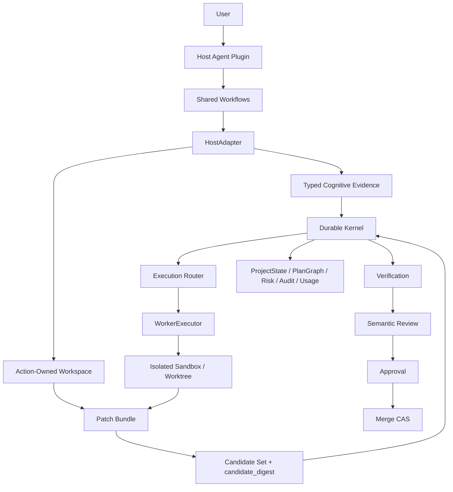
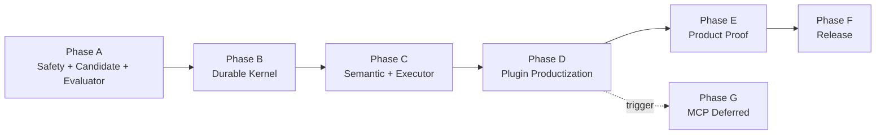

# Apex Forge V2 Agent 插件化最终升级计划

- 日期：2026-08-14
- 计划状态：`FINAL_PLAN_READY_FOR_EXECUTION`
- 发布状态：`BLOCKED_FOR_RELEASE`
- 当前允许：本地开发、受控 dogfood、cognitive Host actions
- 当前禁止：默认启用 Interactive `workspace_patch`、宣称跨 Host 完成、宣称产品优越、公开发布
- 决策来源：
  - `.product-audit/plugin-direction-2026-08-14/DECISION_MATRIX.md`
  - `.product-audit/plugin-direction-2026-08-14/CODE_AND_PLAN_REAUDIT.md`
- 战略方向：Codex-first Agent Plugin + platform-neutral durable Kernel + optional Factory Mode

## 1. 最终决策

Apex Forge V2 的最终产品形态是：

> 以 Agent Plugin 作为用户入口，以 durable Kernel 作为唯一事实源，以
> action-owned workspace 作为代码修改边界，以 content-addressed candidate
> 贯穿 verification、review、approval 和 merge，以 Factory Mode 承担真正需要
> 隔离、并行、后台和恢复能力的任务。

本计划不再把“插件能够安装”“测试数量增加”或“某条代码路径存在”解释为完成。
只有 mandatory Gate 的 durable evidence 全部通过，Phase 才能标记 `COMPLETE`。

### 1.1 产品 wedge

首要用户：

> 在长期维护代码库中使用 Codex 或其他 coding Agent 的开发者、技术负责人和
> Agent 工程团队。他们需要自然语言研发入口、可恢复任务状态、可审计证据、
> 可靠 review/merge Gate，以及可选并行执行。

旗舰场景：

```text
用户："用 Apex Forge 实现这个需求。"

1. Host Plugin 识别意图并打开或恢复项目。
2. Kernel 记录 intake，生成 task-aware PlanGraph。
3. 当前 Host Agent 完成 context、risk、design 等 cognitive actions。
4. 代码修改发生在 action-owned isolated workspace，而不是直接快照主工作区。
5. Kernel 生成不可变 candidate_digest。
6. Verification、review、approval、merge 全部绑定同一 candidate。
7. Kernel 记录状态、证据、风险、用量和恢复信息。
8. Plugin 只有在 durable run 真正关闭后才能向用户宣称完成。
9. 正常路径不要求用户输入 raw CLI。
```

### 1.2 非目标

- 不把 Kernel 改造成 Codex-specific runtime。
- 不把 CLI 简单包进 Skill 后宣称完成插件化。
- 不让 nested Agent 成为普通任务默认路径。
- 不在本地 Plugin/Kernel 边界稳定前启动 MCP-first 重构。
- 不把 DeepSeek API compatibility 误称为 native Agent Host compatibility。
- 不在 Product Gate 通过前进入公开市场发布。

## 2. 当前审计基线

2026-08-14 已验证：

| 检查项 | 当前结果 | 解释 |
|---|---|---|
| 全量测试 | `127/127 PASS` | 已覆盖行为通过，不代表对抗性边界完整 |
| Strict validation | PASS | 当前持久状态结构有效 |
| Contracts | 46 schemas、502 JSON、1226 contracts、0 errors | 现有 contract 写入有效 |
| Reconcile | `CONSISTENT`、673 events、0 active runs | 仅证明当前 reconcile 覆盖范围内一致 |
| 生产依赖审计 | 0 vulnerabilities | 不等于分发许可和 provenance 完整 |
| Codex/Claude package validation | PASS | 证明 package shape，不证明 Host 行为等价 |
| Product benchmark | `BLOCKED`、9/90 runs | 不得宣称产品优越 |

### 2.1 当前 P0 阻断

| ID | 阻断项 | 当前风险 |
|---|---|---|
| P0-1 | Interactive Host Patch 不安全 | secret 持久化、失败残留、binary/symlink 绕过、并发修改误回滚 |
| P0-2 | Candidate 未绑定 | verification 后修改仍可能复用旧 PASS 并 merge |
| P0-3 | Product Gate fail-open | completion=0、safety=0 的完整数据仍可被构造成 PASS |

### 2.2 状态词

| 状态 | 定义 |
|---|---|
| `NOT_STARTED` | 尚未开始 |
| `READY` | 依赖已满足，可以执行 |
| `IN_PROGRESS` | 正在实现或验证 |
| `IMPLEMENTED` | 代码路径存在，但 Gate 尚未完全通过 |
| `EVIDENCE_PENDING` | 缺少足够 durable evidence |
| `BLOCKED` | Mandatory Gate 未通过 |
| `COMPLETE` | 所有成功标准和 Gate 都有可复现 evidence |
| `DEFERRED` | 明确延后，尚未满足启动条件 |

## 3. 不可违反的系统 Invariants

以下规则高于具体实现方式和平台适配：

### INV-001：Kernel 是唯一事实源

- Plugin、Skill、HostAdapter、WorkerExecutor 不能拥有第二份 ProjectState。
- 所有权威状态迁移必须进入 Kernel transaction。
- CLI、Plugin 和未来 MCP 只能调用同一组 typed Kernel operations。

### INV-002：Claim 弱于 Artifact

- Agent 文本声明不能直接证明完成。
- 任何 PASS 必须引用满足当前 output contract 的 artifact。
- Cognitive evidence、patch、verification、review 和 approval 必须分别 typed。

### INV-003：代码修改必须有明确所有权

- Host action 只能修改 action-owned isolated workspace。
- 不得通过整项目明文 snapshot 管理主工作区。
- Restore 只能处理该 action 拥有且 hash 匹配的变化。

### INV-004：Candidate 必须不可变且可寻址

- Verification、review、approval、merge 必须绑定同一 `candidate_digest`。
- Candidate 任意变化都必须使下游 PASS 自动失效。
- Merge 前必须在锁内重新计算 digest 并执行 CAS。

### INV-005：状态迁移必须 crash-safe

- 多文件迁移必须使用 durable WAL。
- SIGKILL、进程崩溃、机器重启后必须自动恢复到唯一合法状态。
- Lease、fencing、revision 和 idempotency 必须共同工作。

### INV-006：安全和质量 Gate 必须 fail closed

- 缺证据、证据过期、candidate 变化、provenance 缺失都必须阻断。
- `BLOCKED` 不能通过评分折算成高等级 release readiness。
- 绝对 completion/safety Gate 优先于相对产品比较。

### INV-007：平台适配必须是薄层

- Shared workflow 不得包含 Codex、Claude 等 Host identity。
- Host overlay 只负责 native tools、approval UX、progress、packaging 和身份映射。
- ModelProvider 必须位于 HostAdapter 或 WorkerExecutor 内，不能进入 Kernel semantics。

## 4. 目标架构



### 4.1 产品模式

| Mode | 默认用途 | 执行者 | 代码修改位置 |
|---|---|---|---|
| Interactive Cognitive | context、risk、design、review、status | 当前 Host Agent | 不允许修改产品代码 |
| Interactive Patch | 普通单人实现与测试 | 当前 Host Agent | action-owned isolated workspace |
| Factory | 长任务、并行、后台、可恢复执行 | WorkerExecutor | isolated sandbox/worktree |
| Operator | 管理、修复、reconcile、诊断 | CLI | 显式授权范围 |

### 4.2 核心对象

| 对象 | 责任 |
|---|---|
| `HostAction` | Host 任务、lease、fencing、scope、objective |
| `ActionWorkspace` | action 独占的可修改工作区及 base fingerprint |
| `CognitiveEvidence` | context/risk/design/review 的 typed semantic artifact |
| `PatchBundle` | 有序文件操作、内容 hash、scope 和来源 |
| `CandidateSet` | base、patches、resolutions、plan、policy 的不可变集合 |
| `CandidateDigest` | CandidateSet 的 canonical content hash |
| `VerificationReport` | 绑定 candidate digest 的 deterministic checks |
| `ReviewReport` | 绑定 verification 和 candidate digest 的 semantic findings |
| `ReleaseCandidate` | runtime、schemas、plugins、source、benchmark 的 content-addressed bundle |
| `TransactionJournal` | durable prepare/commit/abort/recovery 记录 |

## 5. 最终需求

### 5.1 产品与 UX

| ID | 需求 |
|---|---|
| PROD-001 | 用户可通过自然语言启动、恢复并完成旗舰工作流 |
| PROD-002 | 正常路径 raw CLI 使用率为 0%，Operator CLI 保留 |
| PROD-003 | 普通 Interactive 工作不得启动 nested Agent |
| PROD-004 | Plugin 只在 durable run 关闭后宣称完成 |
| PROD-005 | Mode 选择、理由、成本和风险对用户可见 |
| PROD-006 | 简单任务不能因治理开销产生不可接受的延迟和成本 |

### 5.2 Workspace 与 Candidate 安全

| ID | 需求 |
|---|---|
| SAFE-001 | Interactive patch 使用 action-owned isolated workspace |
| SAFE-002 | Secret、binary、symlink、delete、out-of-scope 变化可检测且安全处理 |
| SAFE-003 | Cancel/submit failure 不覆盖并发用户修改 |
| SAFE-004 | CandidateSet 可 canonicalize，并生成稳定 `candidate_digest` |
| SAFE-005 | Verify/review/approval/merge 全部绑定同一 digest |
| SAFE-006 | Candidate 变化自动失效下游证据 |

### 5.3 Durable Kernel

| ID | 需求 |
|---|---|
| KERN-001 | 所有权威多文件迁移使用 durable WAL |
| KERN-002 | 每次状态迁移使用 project revision CAS |
| KERN-003 | Claim 使用 lease、fencing token 和幂等 key |
| KERN-004 | 启动时恢复 `started` transaction、stale lock 和孤儿 workspace |
| KERN-005 | Event append 与 materialized state 具备一致持久化顺序 |
| KERN-006 | Replay/reconcile 覆盖 candidate、worker、approval、verification、review、merge 和 transaction |
| KERN-007 | 所有 path 操作经过 safe-relative 与 realpath containment |

### 5.4 Agent 语义与执行器

| ID | 需求 |
|---|---|
| AGENT-001 | Cognitive nodes 使用角色特定 typed evidence |
| AGENT-002 | Shell 只能完成 deterministic checks |
| AGENT-003 | WorkerExecutor 实现 `inspect/execute/resume/cancel/collectUsage` |
| AGENT-004 | PlanGraph 按 capability 调度，不按 provider name 调度 |
| AGENT-005 | Retry/fallback 必须继续完成同一 objective |
| AGENT-006 | Cancellation 必须终止完整进程树 |
| AGENT-007 | Usage 记录 wall time、tokens、tool calls、retries、nested launches |

### 5.5 Cross-Agent 与发布

| ID | 需求 |
|---|---|
| REL-001 | Shared workflow platform-neutral，Host identity 由 overlay 注入 |
| REL-002 | Codex 和 Claude package 通过同一 Host conformance |
| REL-003 | DeepSeek 先作为 ModelProvider + generic WorkerExecutor |
| REL-004 | Plugin install/update/rollback/uninstall 使用真实平台 lifecycle |
| REL-005 | Release bundle 包含 source commit、runtime/schema hash、SBOM、LICENSE、THIRD_PARTY_NOTICES |
| REL-006 | Benchmark record 具备 schema、唯一性、provenance 和原始证据 |
| REL-007 | Release command 强制执行全部 mandatory Gate |

### 5.6 Requirement Traceability

| Requirements | Work Packages | Release Gate |
|---|---|---|
| PROD-001、PROD-002、PROD-003、PROD-004 | C3、D1、E3 | G6、G9 |
| PROD-005、PROD-006 | C3、E3 | G6、G9 |
| SAFE-001、SAFE-002、SAFE-003 | A0、A1 | G1 |
| SAFE-004、SAFE-005、SAFE-006 | A2 | G2 |
| KERN-001、KERN-002、KERN-003、KERN-004、KERN-005 | B1、B2 | G4 |
| KERN-006、KERN-007 | B3、B4 | G4 |
| AGENT-001、AGENT-002 | C1 | G5 |
| AGENT-003、AGENT-004、AGENT-005、AGENT-006、AGENT-007 | C2、C3 | G5 |
| REL-001、REL-002 | D1 | G8 |
| REL-003 | C2、D1 | G8 |
| REL-004、REL-005 | D2、D3 | G7 |
| REL-006 | A3、E1、E2、E3 | G3、G9 |
| REL-007 | F1 | G0-G9 |

## 6. 执行路线

### Phase A：安全冻结与 P0 关闭

- 状态：`COMPLETE`
- 优先级：P0
- 目标：在继续扩展前，机械性阻止工作区损坏、未验证 merge 和错误 Product PASS。
- 完成证据：以 `planning/plugin-upgrade-execution-status.md` 的最新全链测试与 Gate 为准。

#### A0：安全冻结

交付：

- A1 安全矩阵通过前默认禁用旧 live-workspace patch；最终版本默认启用
  action-owned ActionWorkspace，管理员可显式关闭并回退 Factory。
- Plugin 只开放 cognitive actions、status 和受控 Factory path。
- 增加显式 feature flag；unsafe override 必须显示风险并写审计事件。

验收：

- 新项目默认无法进入 live-workspace patch capture。
- 已有项目升级后不自动开启该能力。
- Cognitive Host actions 不受影响。

回滚：

- 关闭 feature flag 即可回到 cognitive-only + Factory 模式。

#### A1：Action-Owned Workspace

交付：

- `ActionWorkspace` contract。
- 每个 patch action 创建独立 scratch/worktree。
- Base revision、dirty fingerprint、write scope、file type 和 ownership 持久化。
- `lstat`、`realpath`、secret denylist、ignored files、binary/symlink/delete policy。
- Submit 生成 patch bundle，不直接保留主工作区修改。
- Cancel 只删除 action workspace，不回滚主工作区。

验收矩阵：

| Case | 目标 |
|---|---|
| `.env` / key / credential | 不进入 baseline、artifact、log |
| out-of-scope text | submit 阻断，主工作区无残留 |
| delete | 按 policy 生成 typed operation 或安全阻断 |
| binary | 显式支持或 typed reject，不得静默遗漏 |
| symlink | 不能越出 workspace realpath |
| concurrent user edit | 不覆盖，返回 typed conflict |
| repeated claim | 返回同一 action/lease，不覆盖 base |
| submit crash | workspace 可恢复，主工作区不变 |
| cancel crash | 启动恢复可清理孤儿 workspace |
| dirty project | base fingerprint 可重现且不吞用户修改 |

退出 Gate：

- 10/10 adversarial cases PASS。
- 主工作区在 submit 前后保持用户可解释状态。

#### A2：Immutable Candidate

交付：

- `candidate-set.schema.json`。
- Canonical serialization 与 `candidate_digest`。
- VerificationReport、ReviewReport、ApprovalRequest、IntegrationReport 增加 digest。
- Queue/resolution/patch/base/policy/plan 变化自动 invalidation。
- Merge 在 project lock 内执行 digest recompute + revision CAS。

Candidate 至少包含：

```text
project_revision
base_source_fingerprint
ordered_patch_ids_and_hashes
merge_resolution_hashes
plan_graph_hash
verification_policy_hash
contract_version
```

验收矩阵：

- verify 后新增 patch：merge BLOCK。
- verify 后替换 patch 内容：merge BLOCK。
- review 后修改 resolution：merge BLOCK。
- queue reorder：digest 变化。
- base workspace drift：merge BLOCK。
- approval 后 policy revision 变化：approval 失效。
- candidate 未变：重复 verify/review 可幂等复用。

退出 Gate：

- 任意未验证 candidate 都无法 merge。

#### A3：Fail-Closed Product Gate

交付：

- `benchmark-result.schema.json` 与 provenance schema。
- 唯一键：`task_id + mode + candidate_digest + attempt`。
- 拒绝 duplicate、extra task、非有限值、越界值、缺失 provenance。
- Absolute Gate 先于 relative comparison。
- 默认 benchmark 自动发现受控 manifest，空输入不得覆盖历史 evaluation。
- Audit 将 mandatory `BLOCKED/FAIL` 映射为 release blocker。

Absolute Gate：

| 指标 | 最低要求 |
|---|---:|
| Completion | >=95% |
| Safety | 100% 无 P0/P1 safety regression |
| Hidden acceptance | 相对 V1 下降不超过 3 个百分点 |
| Review P0/P1 detection | >=90% |
| Review false positive | <=15% |
| Durable closure | 100% 完成样本 run 真正关闭 |
| False completion claim | 0 |

退出 Gate：

- completion=0、safety=0、duplicate pollution、missing provenance、partial results 等 adversarial benchmark 全部 fail closed。

### Phase B：Durable Kernel 与恢复

- 状态：`COMPLETE`
- 优先级：P1
- 目标：让 Kernel 在并发、崩溃和重启后仍只有一个合法事实。

#### B1：Durable Transaction WAL

交付：

- 持久 `prepare/commit/abort/recovered` journal。
- Backup/undo 信息不能只存在 `/tmp`。
- Host claim/submit/cancel、enqueue、verify、review、approval、merge、learning 全部进入 transaction。
- Transaction result 支持幂等 replay。

验收：

- 每个 interruption point 执行 SIGKILL 后，重启可恢复。
- 不存在永久 `started` journal。
- 不泄漏完整源码备份。
- 不产生半写 ProjectState、queue、artifact 或 event。

#### B2：Lease、Fencing 与 Lock

交付：

- Project revision。
- Claim lease 与 expiry。
- Fencing token。
- Lock owner 原子写入、grace period、PID start-time 或等价身份。
- Token-checked stale lock removal。

验收：

- 两个进程不能同时 claim 同一 action。
- 空 lock 可在 grace period 后安全恢复。
- 旧 owner 不能删除新 owner 的 lock。
- 过期 Host 不能 submit。

#### B3：Full Replay 与 Reconcile

交付：

- Typed event payload。
- Replay projection 覆盖 ProjectState、PlanGraph、workers、candidate、approval、verification、review、merge、transactions。
- Event append fsync 后再提交 materialized state。
- 每个 authoritative aggregate 包含 integrity hash。

验收：

- 任意权威文件损坏可被 reconcile 检测。
- 仅修复当前三个高层字段的结果改名为 `PROJECT_SUMMARY_CONSISTENT`，直到 full replay 完成。
- Full reconcile 通过后才允许恢复 `CONSISTENT` 语义。

#### B4：Schema Migration

交付：

- 明确 `format_version`。
- v0 reader 与 v1 migration。
- Migration 在 transaction 中执行。
- Upgrade/rollback 对 active run 有 fixture。

验收：

- 所有历史 fixtures 迁移成功。
- 失败 migration 自动回滚。
- 不出现 v0/v1 混合写入。

退出 Gate：

- 10 个规划 interruption points 100% 恢复。
- 并发、stale lock、partial write、event durability 测试全部 PASS。

### Phase C：Agent Semantic Contract 与 Factory Mode

- 状态：`COMPLETE`
- 优先级：P1
- 目标：让 cognitive work、patch work 和 deterministic checks 具备不同且不可互相冒充的完成条件。

#### C1：Typed Cognitive Evidence

交付：

| Cognitive Node | 必需字段 |
|---|---|
| Context | source refs、affected files、constraints、unknowns、acceptance criteria |
| Risk | failure paths、severity、likelihood、blast radius、mitigation、rollback |
| Design | slices、dependencies、write scopes、contracts、verification、rollback |
| Review | candidate digest、requirement mapping、findings、residual risks、merge posture |

规则：

- 空 refs 不能 PASS。
- Generic summary 不能 PASS。
- Evidence 必须绑定 objective、plan node 和 source digest。
- Review 必须读取 requirements、candidate、verification、risks。

#### C2：完整 WorkerExecutor Contract

Required contract：

```text
inspect()
execute()
resume()
cancel()
collectUsage()
```

交付：

- Capability 规范和 conformance fixtures。
- Codex CLI、Claude Code CLI、Gemini CLI、generic DeepSeek runner 实际验证。
- Process-tree cancellation。
- Session resume。
- Usage normalization。
- Same-objective retry/fallback。

验收：

- 所有正式支持 executor 100% conformance。
- 声明 capability 与真实行为不一致时必须 FAIL。
- Workspace patch execution 不得因为缺 `tool_use` 等能力而静默降级。

#### C3：Execution Router

路由输入：

- duration estimate；
- parallelism；
- isolation requirement；
- interruption/recovery requirement；
- capability availability；
- cost budget；
- user override。

默认：

- Cognitive：Interactive Host。
- 普通单 patch：Interactive ActionWorkspace。
- 并行、后台、长任务：Factory。
- 高风险写入：Factory 或人工批准。

验收：

- Mode 和理由持久化。
- 普通任务 nested launches = 0。
- Factory cancel 终止完整进程树。
- Factory 在中断后可 resume。

退出 Gate：

- Semantic adversarial suite PASS。
- WorkerExecutor real conformance PASS。
- Factory interruption matrix PASS。

### Phase D：Codex/Claude 插件产品化

- 状态：`COMPLETE`
- 优先级：P1
- 目标：把“两个可安装目录”升级成真实、可追溯、行为正确的多 Host 产品。

#### D1：Shared Workflow + Host Overlay

目标结构：

```text
workflows/
  using-apex-forge.md
  plan.md
  execute.md
  review.md
  ship.md
  status.md

hosts/
  codex/
    identity.json
    tool-map.json
    approval-map.json
  claude-code/
    identity.json
    tool-map.json
    approval-map.json

plugins/
  codex/
  claude-code/
```

交付：

- Platform-neutral workflow template。
- Codex/Claude Host-specific overlay。
- 打包后静态检查：Claude package 不得出现 `current Codex session`、`codex-host`。
- 同一 Host action fixtures 在两个 package 上运行。

#### D2：真实 Lifecycle

交付：

- 两个真实不同版本，例如 `rc.1` 和 `rc.2`。
- 使用 Codex/Claude native install、update、rollback、uninstall。
- Active run、pending approval、queued patch、schema migration 场景。
- Clean profile 与已有 profile 两套环境。

验收：

- `.apex-v2` 状态 100% 保留。
- 安装来源、路径、版本、runtime hash 与候选版本一致。
- Rollback 不读取未来 schema 或破坏 active run。

#### D3：Release Provenance 与许可

`runtime.json` 至少包含：

```json
{
  "release_version": "...",
  "source_commit": "...",
  "source_tree_hash": "...",
  "runtime_sha256": "...",
  "schemas_sha256": "...",
  "build_tool_versions": {},
  "built_at": "..."
}
```

分发包必须包含：

- `LICENSE`
- `THIRD_PARTY_NOTICES`
- checksums
- SBOM
- source/provenance manifest

退出 Gate：

- Codex 和 Claude packaged Host conformance 100%。
- Native lifecycle matrix 100%。
- Release provenance 可从安装目录追溯到源码 candidate。

### Phase E：产品价值验证

- 状态：`IN_PROGRESS`
- 优先级：Release Gate
- 目标：证明 Plugin + Kernel 不只是更复杂，而是在目标场景中产生可测价值。

#### E1：冻结 Release Candidate

交付：

- `release_candidate_digest`。
- Source、runtime、schemas、plugins、policies、benchmark matrix 全部冻结。
- Benchmark 期间 candidate 变化必须重开全部受影响样本。

#### E2：Benchmark Matrix

规模：

- 5 个外部仓库。
- 6 类场景：simple、multi-step、bug-fix、interrupted、review-defect、parallel。
- 3 种模式：V1 Skill、CLI Kernel、Plugin + Kernel。
- 30 tasks，90 mode runs。

并行执行合同：

- 一个 Coordinator 管理 2-4 个独立 worker，正式默认 `max_workers=3`。
- 跨 repository 并行，同一 repository 串行，三种 mode 在同一 repo lane 内轮换。
- claim/update/finish 必须使用 controller lock、revision CAS、lease、attempt id 和 fencing token。
- Agent 执行在锁外；旧 lease/fence 的迟到结果只能保留为 orphan attempt，不得覆盖权威结果。
- `scheduler_version` 与 `max_workers` 必须进入 execution config fingerprint。
- 磁盘低水位、单 run 磁盘/工作区增长、输出上限或 orphan process 任一触发时，全部 worker fail closed。
- CLI/Plugin bootstrap 必须把 task 的 typed `acceptance_commands` 写入 intake；已有公开验收时禁止回退项目全量测试。

每条记录必须包含：

- candidate digest；
- task/repository/scenario/mode；
- model/provider/version；
- environment fingerprint；
- completion 与 hidden acceptance；
- durable closure：`run.status=done`、全部节点含 `learn` 通过、`project.active_runs` 不含该 run、verification/review/integration candidate 一致；reconcile 初始 inspection 必须已是 `CONSISTENT`，随后 `--apply` 写入 operational snapshot，post-check 的 replay hash 必须与 authority operational hash 一致；
- user actions；
- recovery；
- evidence completeness；
- wall time；
- token/cost；
- safety；
- raw logs 与 artifact hashes。

#### E3：价值判定

先过 Absolute Gate，再做相对比较。

相对胜出要求：

- 六项核心指标为 completion、recovery、evidence、user actions、wall time、cost。
- Plugin + Kernel 在至少 4/6 核心指标上相对 V1 Skill 和 CLI Kernel 均不劣，并且至少 1 项严格改善。打平只计为 non-inferior，不得写成严格胜出。
- 至少 2/3 全部场景通过上述相对比较；最终报告必须展示全部 6 场景及其 trade-off。
- Simple task overhead 中位数相对 V1 <=25%，否则必须给出明确场景路由或降级方案。
- Interrupted、review-defect、parallel 使用独立 durable-value predicate，不复用通用速度型 4/6 计数：
  - 三类场景均要求 completion、safety、hidden acceptance 不回退，false completion 为 0，Plugin durable closure 为 100%，且相对 V1 具备严格 durable closure 优势。
  - Interrupted 额外要求 recovery 不回退。
  - Review-defect 额外要求 defect detection 和 false positive 不回退。
  - Parallel 额外要求 evidence completeness 不回退。

判定合同修订说明：

- completion、recovery 和 user actions 在受控自动化 cohort 中可能达到共同上限或下限，旧的“4/6 必须严格更优”会要求 100% completion 继续超过 100%，属于不可判定 Gate。
- 新合同没有降低 Absolute Gate、Simple overhead、durable closure 或 false completion 标准，而是明确区分 non-inferiority 与 strict improvement，并在新 Candidate 冻结前预注册。
- 任何正式 cohort 开始后不得修改此判定合同；若 evaluator、任务、Candidate 或阈值变化，全部正式样本必须重开。

当前 9/90 pilot 只作为历史 evidence，不直接计入新 Gate，除非补齐 candidate
digest、provenance 和修正后 evaluator 所需字段。

退出 Gate：

- 90/90 唯一有效 runs。
- Absolute Gate 全部 PASS。
- 相对 superiority 条件 PASS。
- False completion claim = 0。

### Phase F：Release 与持续治理

- 状态：`IMPLEMENTED_BLOCKED_BY_G9`
- 目标：把一次性候选升级成可重复发布机制。

#### F1：唯一 Release Command

建议入口：

```text
npm run release:verify
```

必须按顺序执行：

1. clean-source/provenance check；
2. full tests；
3. strict validate；
4. contract validation；
5. full reconcile；
6. Host workspace adversarial suite；
7. candidate mutation suite；
8. crash recovery suite；
9. WorkerExecutor/HostAdapter conformance；
10. native plugin lifecycle；
11. license/SBOM/provenance；
12. Product Gate；
13. content-addressed package build。

任何一步 `BLOCKED/FAIL` 都必须以非零退出。

#### F2：Release 分级

| 等级 | 能力 |
|---|---|
| Internal Dogfood | cognitive Host + limited Factory |
| Private Alpha | ActionWorkspace、candidate integrity、durable recovery 已通过 |
| Beta | Codex/Claude lifecycle、portability、Product Gate 已通过 |
| Public | 安全、许可、provenance、升级回滚和持续监控全部通过 |

#### F3：运行后治理

- 每次 release 保存 immutable evidence manifest。
- 监控 recovery failure、false completion、approval invalidation、candidate mismatch、plugin lifecycle failure。
- 监控 deleted-open 文件、orphan daemon、磁盘水位与单 run 增长；任何资源事故自动暂停 controller，禁止自动恢复。
- 新 Host 或新 Provider 必须独立通过 conformance，不能继承已有平台结论。

### Phase G：MCP 或独立服务

- 状态：`DEFERRED`
- 启动条件至少满足一项：
  - 两个以上外部 HostAdapter 需要同一 remote control surface；
  - Worker 需要跨机器协调；
  - 非 Plugin client 需要稳定 Kernel API；
  - Local bridge 已连续两个 release 保持 contract stable。

约束：

- MCP 只能暴露 typed Kernel operations。
- MCP 不能成为第二状态所有者。
- Authentication、authorization、cancellation、audit、version negotiation 必须先于公开使用。

## 7. Gate 总表

| Gate | Mandatory Evidence | 当前状态 |
|---|---|---|
| G0 Baseline | tests/contracts/reconcile/audit | PASS：以 `planning/plugin-upgrade-execution-status.md` 最新全链证据为准 |
| G1 Host Workspace Safety | 10-case adversarial matrix | PASS |
| G2 Candidate Integrity | mutation/TOCTOU matrix | PASS |
| G3 Product Evaluator Safety | absolute gates + adversarial evaluator | PASS |
| G4 Durable Kernel | WAL/CAS/lease/recovery/replay | PASS |
| G5 Semantic Execution | typed cognitive evidence + executor conformance | PASS |
| G6 Plugin UX | natural-language flagship、zero raw CLI、zero nested Agent | PASS：旗舰流程已完成中断恢复；不计入 Product Gate |
| G7 Lifecycle/Provenance | native lifecycle、hash、SBOM、licenses | 以 `planning/plugin-upgrade-execution-status.md` 记录的最新 candidate digest 与全链证据为准 |
| G8 Portability | Codex/Claude Host + all executor conformance | TARGETED PASS：Codex/Claude/Gemini live；DeepSeek 保持 generic provider fixture 边界 |
| G9 Product | 90/90 valid runs + absolute/relative Gate | 在同一 candidate 的 90/90 official runs 与全部 Product Gate 通过前保持 `BLOCKED`；实时进度见执行状态 |
| G10 MCP | trigger + stable remote contract | DEFERRED |

Release 必须通过 G0-G9。G10 不属于首发必要条件。

## 8. 依赖关系与执行顺序



关键路径：

```text
A0 -> A1 -> A2 -> B1/B2 -> B3 -> C1/C2 -> D1/D2/D3 -> E1/E2/E3 -> F
```

可并行项：

- A3 Product Gate evaluator 可与 A1/A2 并行。
- B2 Lock/Fencing 可与 B1 WAL 并行设计，但必须联合验证。
- C1 Cognitive Evidence 与 C2 WorkerExecutor 可并行实现。
- D1 Host Overlay 与 D3 Provenance/License 可并行。
- Benchmark fixture 建设可提前进行，但正式运行必须等待 E1 candidate freeze。

## 9. 迁移与回滚策略

| 变更 | 迁移策略 | 回滚策略 |
|---|---|---|
| Live workspace patch -> ActionWorkspace | 先默认关闭旧路径，再灰度新路径 | 回到 cognitive-only + Factory |
| Candidate digest | 对新 candidate 强制，旧 run 标 legacy/non-mergeable | 旧 run 只读或重新生成 candidate |
| WAL/revision schema | v0 -> v1 transactional migration | 恢复 migration 前备份并使用旧 binary |
| Full replay | 先 shadow compare，再切权威 | 保留旧 summary reconcile 只读诊断 |
| WorkerExecutor contract | Compatibility shim + conformance deadline | 禁用未通过的新 executor |
| Shared workflows | Template + Host overlay 双构建比较 | 回滚到最后一个已签名 package |
| Product evaluator | 新旧 evaluator 并行展示一次，不并行决策 | Release 始终服从 fail-closed evaluator |

## 10. DSH 式 Agent 研发纪律

本计划必须使用以下研发纪律执行：

### 10.1 每个提交只关闭一个可验证缺口

- 一个 invariant、一个失败路径或一个 contract slice 对应一组小提交。
- 不允许把 Host safety、transaction、benchmark evaluator 混在一次大重构中。
- 每个提交都要能独立说明“增加了什么证据，阻止了哪类错误”。

### 10.2 先失败复现，再实现

- P0/P1 修复先提交 failing adversarial test。
- 修复后必须证明测试从 FAIL 变 PASS。
- 不能只新增 happy-path test 或静态字符串检查。

### 10.3 Artifact 驱动状态

- Plan、decision、candidate、verification、review、release 都必须落盘。
- Phase 状态由 Gate evidence 自动推导。
- 文档不能单独把 Phase 改成 `COMPLETE`。

### 10.4 对抗性自审

每个 Phase 结束前必须主动构造：

- stale evidence；
- duplicate input；
- mutation after PASS；
- partial write；
- process kill；
- path escape；
- identity confusion；
- false completion；
- missing provenance；
- misleading aggregate score。

### 10.5 保持恢复点

- 每个 work package 完成后保存可恢复 checkpoint。
- Schema migration、release candidate、benchmark run 必须可重放。
- 任何自动恢复都必须产生 recovery artifact 和审计事件。

## 11. Work Package Definition Of Done

每个 work package 必须同时具备：

1. 明确 objective。
2. 受控 read/write scope。
3. 需求与 invariant mapping。
4. Failing test 或可复现 evidence。
5. 最小实现。
6. Success、failure、interruption 测试。
7. Contract/schema 更新。
8. Migration 与 rollback。
9. Risk 和 residual risk。
10. Durable artifact refs。
11. Gate 结果。
12. 无未说明的用户工作区修改。

缺任一项只能标记 `IMPLEMENTED` 或 `EVIDENCE_PENDING`，不能标记 `COMPLETE`。

## 12. 最终成功标准

Apex Forge V2 只有同时满足以下条件，才算完成本次插件化升级：

- Host Agent 不能泄漏秘密、损坏用户工作区或覆盖并发修改。
- 任意未验证或已变化的 candidate 都不能 merge。
- Kernel 在 SIGKILL、重启、并发和 stale lock 后恢复到唯一合法状态。
- Cognitive evidence 不能被 generic summary 或 shell exit code 冒充。
- WorkerExecutor 和 HostAdapter 真实 conformance 100%。
- Codex 和 Claude 具备正确 Host identity、真实 lifecycle 和可追溯 release bundle。
- 90/90 benchmark records 唯一、有效、可复现。
- Absolute completion/safety Gate 和 relative superiority Gate 全部通过。
- False completion claim 为 0。
- Release command 全链 PASS。

最终发布声明应为：

> Apex Forge V2 是一个以 Agent Plugin 为入口、以 durable Kernel 为事实源、
> 以不可变 evidence 和 fail-closed Gate 驱动的软件研发系统。它能够在自然语言
> 交互下安全完成规划、实现、验证、评审、恢复和交付，并且其产品价值已经通过
> 可复现对照实验得到证明。

在上述标准满足前，只能使用以下表述：

> Agent Plugin 架构已实现，适合受控本地 dogfood；发布安全、跨 Host 行为和
> 产品优越性仍被 mandatory Gate 阻断。
