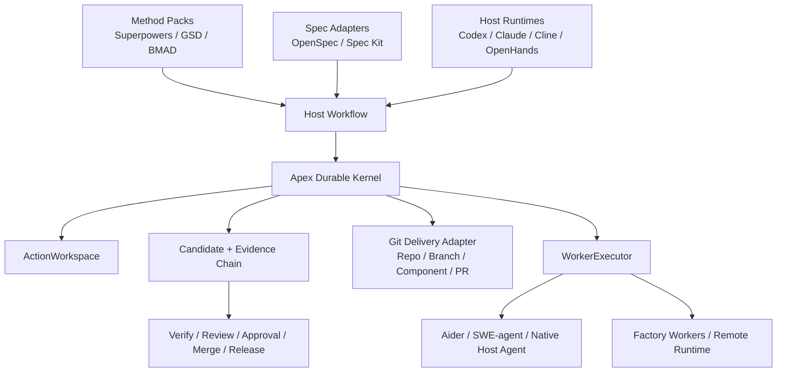

# Apex Forge V2 与业界研发框架静态对比评估

- 评估日期：2026-08-20
- 评估类型：公开仓库静态审计
- Apex Forge V2：`v0.2.0-rc.1`
- Apex verified commit：`60637569f2f21e1cf80f081aa1df658d2dcee400`
- 外部仓库快照：
  `/Users/admin/Documents/AI/Apex-forge/research-repos/industry-frameworks-2026-08-20`
- 重要限制：没有安装或执行任何外部项目，没有跑实际研发任务或第三方测试

## 1. 结论先行

Apex Forge V2 目前不是“最好的 coding Agent”，也不是“最好用的研发方法论插件”。
它最强的位置是：

> **以 Durable Kernel、不可变 Candidate、typed evidence 和 fail-closed Gate
> 组成的项目级交付控制面。**

在本次对比中，没有另一个项目同时提供并明确绑定：

- 项目级 durable state；
- action-owned workspace；
- content-addressed Candidate；
- verification / review / approval / merge 同 digest；
- WAL、revision CAS、lease、fencing 和 replay/reconcile；
- 进程、磁盘、workspace 和输出资源保护；
- 90-run Product Gate 与 candidate-bound Release Gate。

但 Apex Forge 在以下方向不是领先者：

- **研发方法论与低门槛 UX**：Superpowers、GSD Core 更成熟；
- **产品到工程的角色与产物覆盖**：BMAD 更丰富；
- **Spec 生态与组织级扩展**：Spec Kit、OpenSpec 更成熟；
- **Git/PR/MR 执行级守卫**：compforge/devloop 更聚焦、更深入；
- **独立 plan/code/red-team review**：KashZod/devloop 更专门；
- **终端编辑效率与代码 benchmark**：Aider 更成熟；
- **IDE、多端、审批和 SDK 体验**：Cline 更完整；
- **远程 runtime、容器和控制台**：OpenHands 更成熟；
- **科研 benchmark 与轨迹复现**：SWE-agent 更成熟；
- **多 Agent 角色/SOP 表达**：MetaGPT 更成熟；
- **swarm、memory、插件数量和多机协作广度**：Ruflo/Claude Flow 更广；
- **极简自治循环**：Ralph 更简单。

因此 Apex Forge 的正确方向不是把这些项目全部重做一遍，而是：

> **保持 Kernel 和发布治理为核心，向上兼容 Method Pack / Spec Adapter，
> 向下接入 Host Runtime / Git Delivery Adapter / Worker Runtime。**

## 2. 评估边界

本报告只使用以下证据：

- README、AGENTS、architecture、workflow、skills、hooks 和配置文档；
- 仓库目录结构与源码中的状态、锁、事务、sandbox、review 等机制；
- 测试、eval、benchmark 文件的存在和覆盖面；
- GitHub API 的版本、活跃度、许可和发布信息；
- Apex Forge V2 自身已完成的 90-run 与 16-step release evidence。

本报告没有：

- 执行外部框架；
- 安装依赖；
- 运行外部测试；
- 使用同一研发任务进行 head-to-head benchmark；
- 验证 README 中的性能或成功率声明；
- 将 stars 等同于工程质量。

外部项目分数表示“仓库中可定位的机制完整度”，不是运行时成绩。

## 3. 项目清单与快照

| 项目 | 类别 | Snapshot | Stars | Latest release | License | 状态 |
|---|---|---:|---:|---|---|---|
| [Apex Forge V2](https://github.com/d-wwei/apex-forge-v2) | Durable delivery Kernel | `6063756` | 0 | `v0.2.0-rc.1` | MIT | prerelease |
| [Superpowers](https://github.com/obra/superpowers) | Methodology / Skills | `b36e082` | 274,596 | `v6.3.0` | MIT | active |
| [GSD Core](https://github.com/open-gsd/gsd-core) | Context / Phase workflow | `adb46cd` | 8,487 | `v1.11.0` | MIT | active |
| [BMAD Method](https://github.com/bmad-code-org/BMAD-METHOD) | Product-to-engineering method | `67d876f` | 52,100 | `v6.11.0` | MIT | active |
| [GitHub Spec Kit](https://github.com/github/spec-kit) | Spec-driven platform | `ead30d9` | 130,409 | `v0.16.5` | MIT | active |
| [OpenSpec](https://github.com/Fission-AI/OpenSpec) | Lightweight spec/change system | `1ebddd1` | 65,617 | `v1.10.0` | MIT | active |
| [compforge/devloop](https://github.com/compforge/devloop) | Git/PR lifecycle guardrail | `714cdec` | 4 | `v0.3.1` | 未声明 | active |
| [KashZod/devloop](https://github.com/KashZod/devloop) | TDD + independent review loop | `502be24` | 2 | `v2.5.0` | Apache-2.0 | active |
| [Ralph](https://github.com/iannuttall/ralph) | Minimal autonomous loop | `5bc4025` | 952 | `v0.1.3` | 许可信息不完整 | archived |
| [Aider](https://github.com/Aider-AI/aider) | Terminal coding Agent | `5dc9490` | 48,341 | `v0.86.0` | Apache-2.0 | active |
| [OpenHands](https://github.com/OpenHands/OpenHands) | Agent runtime / control plane | `7a9aacb` | 84,556 | `v1.14.0` | MIT | active beta |
| [SWE-agent](https://github.com/SWE-agent/SWE-agent) | Research coding Agent | `3ea751c` | 20,087 | `v1.1.0` | MIT | superseded direction |
| [Cline](https://github.com/cline/cline) | IDE / CLI / SDK Agent platform | `1687514` | 66,526 | multi-package | Apache-2.0 | active |
| [MetaGPT](https://github.com/FoundationAgents/MetaGPT) | Multi-agent SOP framework | `11cdf46` | 69,905 | `v0.8.1` | MIT | active |
| [Ruflo / Claude Flow](https://github.com/ruvnet/claude-flow) | Swarm / memory meta-harness | `fa13ee4` | 68,410 | `v3.38.9` | MIT | active |

说明：

- Stars 是 2026-08-20 的 GitHub API 快照，只代表采用度信号。
- BMAD 的 GitHub license API 返回 `NOASSERTION`，但仓库 LICENSE 和 package
  声明 MIT。
- compforge/devloop 未发现仓库许可证，不能直接复制源码。
- Ralph 仓库已归档，package 声明 MIT，但仓库根许可信息不完整。
- SWE-agent README 明确建议新项目优先 mini-SWE-agent。

## 4. 静态机制评分

评分：1=很弱或缺失，3=可用，5=该层级领先。

| 项目 | 方法论 | Durable state | 机械守卫 | 隔离/并发 | 验证/证据 | UX/入口 | 跨 Host | Eval/发布 | 简洁度 |
|---|---:|---:|---:|---:|---:|---:|---:|---:|---:|
| **Apex Forge V2** | 4.0 | **5.0** | **5.0** | **5.0** | **5.0** | 3.5 | 4.0 | **5.0** | 2.5 |
| Superpowers | **5.0** | 3.5 | 3.0 | 4.5 | 4.5 | **5.0** | **5.0** | 4.5 | 4.0 |
| GSD Core | **5.0** | 4.5 | 4.0 | 4.5 | 4.5 | 4.5 | **5.0** | **5.0** | 2.5 |
| BMAD Method | **5.0** | 4.0 | 2.5 | 3.0 | 3.5 | 4.5 | 4.5 | 4.0 | 2.5 |
| Spec Kit | 4.5 | 4.0 | 3.5 | 3.0 | 4.0 | 4.5 | **5.0** | 4.5 | 3.0 |
| OpenSpec | 4.5 | 4.0 | 2.0 | 2.5 | 3.5 | **5.0** | **5.0** | 4.5 | **5.0** |
| compforge/devloop | 3.5 | 4.0 | **5.0** | **5.0** | 4.0 | 4.0 | 4.0 | 3.5 | 4.0 |
| KashZod/devloop | 4.5 | 3.5 | 2.5 | 3.0 | 4.5 | 3.5 | 1.5 | 2.0 | 4.5 |
| Ralph | 3.0 | 3.5 | 2.0 | 2.0 | 2.5 | 4.0 | 4.0 | 2.5 | **5.0** |
| Aider | 2.5 | 2.5 | 3.0 | 2.0 | 4.5 | **5.0** | 3.0 | **5.0** | 4.5 |
| OpenHands | 3.0 | 4.0 | 3.5 | **5.0** | 4.0 | **5.0** | **5.0** | 4.5 | 2.0 |
| SWE-agent | 3.0 | 4.0 | 3.0 | **5.0** | **5.0** | 2.5 | 3.5 | **5.0** | 3.5 |
| Cline | 3.5 | 4.0 | 4.0 | 4.5 | 4.0 | **5.0** | 4.5 | 4.5 | 2.0 |
| MetaGPT | 4.0 | 3.5 | 2.0 | 3.0 | 3.0 | 3.0 | 3.0 | 4.0 | 2.0 |
| Ruflo / Claude Flow | 4.0 | 4.5 | 3.5 | **5.0** | 3.5 | 3.5 | 3.5 | 3.5 | 1.5 |

不要横向相加形成“总冠军”。例如 Aider 的目标是高效编辑，不应该因为没有
项目治理 Kernel 被判成差产品；OpenSpec 明确不管理 Git，也不应该按 Git guard
能力评价其核心价值。

## 5. 分层冠军

| 层级 | 静态评估领先者 | 原因 |
|---|---|---|
| 研发方法论与自动 Skill 路由 | Superpowers | 强制 brainstorm、TDD、worktree、task review 和完成前验证；多平台分发最成熟 |
| 大项目上下文与 phase loop | GSD Core | fresh-context agents、STATE/ROADMAP/phase artifacts、token budget、verify/review/ship |
| 产品到工程角色与产物 | BMAD | PM、架构、UX、Dev、QA、Epic/Story、Party Mode 和 right-sized process |
| 组织级 Spec 平台 | Spec Kit | constitution、spec/plan/tasks、workflow state/resume、extensions/presets/bundles |
| 轻量 Brownfield Spec | OpenSpec | proposal/spec/design/tasks/archive 简单；30+ 工具；change folder 易审查 |
| Git/PR/MR 机械守卫 | compforge/devloop | protected branch、broad staging、checkout owner、managed worktree、Component validation |
| 独立工程 Review | KashZod/devloop | plan review、implementation conformance、red-team 三个独立上下文 reviewer |
| 极简自治 loop | Ralph | PRD JSON + 每轮新上下文 + Git + append-only progress，机制非常小 |
| 终端 coding UX 与代码 benchmark | Aider | repo map、edit formats、architect/editor mode、Git undo、lint/test、Polyglot benchmark |
| Runtime / Sandbox / Control Plane | OpenHands | Docker/VM/remote agent server、conversation persistence、automation、ACP backend |
| 科研 Agent 与可复现实验 | SWE-agent | ACI、SWE-ReX、trajectory、YAML config、SWE-bench 体系 |
| IDE、多端与审批体验 | Cline | VS Code/JetBrains/CLI/SDK、checkpoint、Plan/Act、browser/MCP、typed runtime hooks |
| 多 Agent 角色/SOP | MetaGPT | `Code = SOP(Team)`，产品/架构/项目/工程角色和文档链 |
| Swarm / Memory / 多机广度 | Ruflo | 大规模 agent/plugin/MCP、swarm topology、vector memory、federation、background workers |
| Durable Delivery Governance | **Apex Forge V2** | Candidate-bound evidence、WAL/CAS/fencing、ActionWorkspace、reconcile、Product/Release Gate |

## 6. Apex Forge V2 的优势

### 6.1 真正的交付事实源

很多框架把 Markdown、tracker、conversation 或 Git commit 当作工作状态。
Apex Forge 的 `.apex-v2` Kernel 同时管理：

- ProjectState；
- PlanGraph；
- worker/action ownership；
- patch/Candidate；
- verification/review/approval/integration；
- risk、usage、audit、reconcile。

这使 Apex 能机械判断“有没有真的完成”，而不是依赖 Agent 自述。

### 6.2 Candidate-bound 交付链

Spec Kit、OpenSpec、GSD、Superpowers 都有强 artifact discipline，但静态证据中
没有看到与 Apex 同等强度的：

```text
Patch Set
  → canonical Candidate digest
  → deterministic verification
  → semantic review
  → approval fingerprint
  → merge CAS
```

这对高风险、长期维护和需要审计的软件交付尤其重要。

### 6.3 工作区与进程安全

Apex 的 ActionWorkspace、scope、secret/binary/symlink/delete 检查、进程树回收、
磁盘/输出/workspace 熔断，是多数 methodology/spec 项目没有覆盖的执行层。

compforge/devloop 在 Git branch/checkout 安全上更强，但 Apex 在 Candidate、
staged verification 和进程资源边界上更完整。

### 6.4 发布证据最完整

Apex 已经拥有：

- 263/263 tests；
- 55 schemas、1256 contract validations；
- 90/90 official Product Benchmark；
- Product Gate；
- 16-step candidate-bound Release Gate；
- 双平台 package validator 与 native lifecycle；
- SBOM、license、checksums 和 immutable assets。

Aider、SWE-agent、Superpowers、GSD 等有更成熟或更广的 eval/test 体系，但 Apex
的优势是把**产品价值、发布身份和交付证据绑定在同一个 Candidate 上**。

## 7. Apex Forge V2 的短板

### 7.1 方法论 UX 不如 Superpowers / GSD

Apex 的 Kernel 语义强，但面向用户的“如何把模糊需求变成好设计、好计划、好测试”
仍不如 Superpowers 清晰。

差距包括：

- 缺少成熟的自动 Skill 触发心智模型；
- brainstorm、TDD、systematic debugging 的教学性不足；
- 计划文档不如 Superpowers 的 task-level 指令具体；
- 缺少 GSD 那样明确的 context budget、fresh-context 和 phase UX；
- full route 的成本和耗时明显偏高。

### 7.2 Git/PR/MR 生命周期不如 compforge/devloop

Apex 有 merge queue 和 Candidate CAS，但不等于完整的团队 Git delivery loop。

缺口包括：

- protected branch execution guard；
- broad staging 拒绝；
- branch-create transaction；
- checkout owner lock；
- GitHub/GitLab peer provider；
- PR/MR continuation 和 resumable rebase；
- monorepo Component-level validation；
- human merge 的团队工作流。

### 7.3 Spec 生态不如 Spec Kit / OpenSpec

Apex 的 Intake/PlanGraph 更偏执行调度，Spec Kit/OpenSpec 更擅长：

- constitution / organizational principles；
- human-readable requirements + scenarios；
- spec delta 和 change archive；
- extension、preset、bundle；
- spec store 和跨 repo requirements；
- 安装升级时保护用户 artifact。

### 7.4 Runtime 与 IDE 体验不如 Cline / OpenHands

Apex 不应自己重做 IDE、terminal、browser、remote server 和 automation UI。

当前差距：

- 没有成熟 IDE diff/approval/checkpoint UX；
- 没有远程 Agent Server 和多 backend 控制台；
- 没有 schedule/webhook/IM automation 产品面；
- HostAdapter 生态仍小；
- 没有 ACP 级通用 Agent backend 接口。

### 7.5 多 Agent 与 Reviewer 专业化不足

Apex 有 WorkerExecutor 和并行 controller，但专业角色设计不如：

- BMAD 的 PM/Architect/UX/Dev/QA；
- KashZod 的 review-plan/review-impl/red-team；
- MetaGPT 的 SOP role team；
- Ruflo 的 swarm/memory/topology。

Apex 当前的优势是治理，不是 agent roster 数量。

### 7.6 社区和扩展生态几乎为空

Apex 的公开仓库当前没有社区采用数据。与 Superpowers、Spec Kit、Cline、
OpenHands、OpenSpec 等相比：

- 缺少第三方 Method Pack；
- 缺少 HostAdapter / WorkerExecutor marketplace；
- 缺少组织模板、preset 和 bundle；
- 文档刚达到 release candidate 水平；
- 缺少外部 benchmark 和独立使用案例。

## 8. 最值得借鉴的机制

### P0：下一版最应该做

#### 1. Method Pack 层

借鉴 Superpowers 和 GSD，但不写入 Kernel：

```text
Method Pack
  - brainstorm
  - spec
  - plan
  - TDD
  - debug
  - review
  - ship
        ↓ typed evidence
Durable Kernel
```

Kernel 只定义 contract，不绑定一种方法论。默认提供：

- `superpowers-like`：高纪律 TDD；
- `gsd-like`：phase/context engineering；
- `quick`：低风险快速路线。

#### 2. Git Delivery Adapter

优先吸收 compforge/devloop 的概念：

- Repo / Branch / Component / PR 四个对象；
- checkout owner；
- protected branch guard；
- broad staging guard；
- managed worktree；
- GitHub/GitLab provider；
- PR continuation/rebase；
- human merge。

不能直接复制 compforge/devloop 源码，仓库未声明许可证。

#### 3. Spec Adapter

不要复制 Spec Kit 或 OpenSpec 做一套新 spec 工具。增加适配：

```text
OpenSpec Change / Spec Kit Feature
          ↓
      Intake + Requirement refs
          ↓
        PlanGraph
          ↓
        Candidate
```

首选 OpenSpec 作为轻量 change format，Spec Kit 作为组织级 profile。

#### 4. 降低 full route 成本

结合 GSD 的 context budget 和 Superpowers 的 task-scoped review：

- cognitive node 合并成一次 Host pass；
- 只把当前 node 需要的 artifact 注入上下文；
- plan/task 级独立 workspace；
- verification 增量化；
- review package 只包含 diff、spec 和 acceptance mapping；
- 使用 measured token actuals 调整 route。

目标：

- complex wall time 降低至少 40%；
- complex token 降低至少 50%；
- completion/safety/durable closure 保持 1.0。

### P1：产品能力增强

#### 5. Independent Reviewer Pack

借鉴 KashZod/devloop：

- plan compliance reviewer；
- implementation conformance reviewer；
- adversarial red-team reviewer。

三个 reviewer 输出独立 typed evidence，Kernel 负责去重、裁决和 merge posture。

#### 6. Host Runtime 适配

优先接入，不自研：

- Cline SDK/runtime hooks；
- OpenHands Agent Server / ACP；
- Aider 作为高效 code-edit WorkerExecutor；
- SWE-agent / mini-SWE-agent 作为 benchmark/research executor。

#### 7. Extension / Preset / Bundle

借鉴 Spec Kit：

- Method Pack；
- Policy Pack；
- Eval Pack；
- Host Pack；
- Domain Pack；
- Team Bundle。

安装必须有版本、来源、许可、hash 和 compatibility contract。

### P2：谨慎吸收

#### 8. BMAD Role Pack

提供 PM、Architect、UX、QA 等可选角色，但不让 persona 成为 Kernel 状态。

#### 9. Swarm 和长期 Memory

可以吸收 Ruflo/MetaGPT 的 topology、memory 和 specialist patterns，但必须：

- 保持 WorkerExecutor contract；
- 不让 vector memory 成为第二事实源；
- 所有合并结果回到 Candidate；
- 多机 federation 只在 MCP/remote trigger 满足后启动。

#### 10. Ralph Quick Loop

可为小项目提供：

- JSON story queue；
- one-story-per-iteration；
- fresh context；
- append-only progress。

但不能使用默认 `--yolo` 或自动 commit 替代 Apex 的 workspace/candidate Gate。

## 9. 不应照搬的部分

| 项目 | 不应照搬 |
|---|---|
| Superpowers | 所有任务一律重 TDD/重 review，可能放大低风险任务成本 |
| GSD | 大量命令、artifact 和配置直接进入 Apex Core |
| BMAD | persona/role 爆炸和过长的产品流程 |
| Spec Kit | 把所有项目强制成同一种阶段式文档工作流 |
| OpenSpec | 仅靠团队约定，不做执行级 enforcement |
| compforge/devloop | 未明确许可的源码；test failure 默认不阻断的策略 |
| KashZod/devloop | Agent failure 后 self-check 直接放行关键 Gate |
| Ralph | `--yolo` runner、自动 commit 和弱 Candidate 绑定 |
| Aider | 用自动 Git commit 代替项目级状态与审计 |
| OpenHands | 在 Apex 内重做完整前端、remote server 和 sandbox 平台 |
| SWE-agent | 将 benchmark issue-solving 假设直接用于真实团队交付 |
| Cline | 把 UI checkpoint 当成正式 Candidate/approval 证据 |
| MetaGPT | 角色对话或生成文档被当成已验证工程结果 |
| Ruflo | 100+ agents / 300+ tools 进入默认上下文和核心安装面 |

## 10. 推荐目标架构



Apex Forge 应成为：

> **不同研发方法论、Spec 系统、Host Agent 和执行器之间的可信交付 Kernel。**

而不是：

> 又一个内置 100 个 Agent、自己做 IDE、自己做 Git forge、自己做所有方法论的
> 巨型 Agent 平台。

## 11. 如果未来做运行对比

本次没有执行外部项目。后续如需要正式 benchmark，应分赛道，不能用同一总榜：

### Methodology Lane

- Apex Method Pack
- Superpowers
- GSD Core
- BMAD
- KashZod/devloop

测试：需求澄清、计划质量、TDD、review finding、上下文恢复。

### Spec Lane

- Apex Spec Adapter
- Spec Kit
- OpenSpec

测试：需求追踪、变更 delta、brownfield 更新、跨 repo spec、artifact drift。

### Delivery Guardrail Lane

- Apex Git Delivery Adapter
- compforge/devloop

测试：保护分支、并发 checkout、partial validation、rebase、PR continuation。

### Runtime Lane

- Apex Factory
- Cline
- OpenHands
- Aider
- mini-SWE-agent

测试：sandbox、长任务、tool failure、resume、成本、实际补丁质量。

只有同赛道、同模型、同任务、同 timeout、同隐藏验收和同环境时，才适合做运行优劣结论。

## 12. 最终判断

### Apex Forge 已经领先的部分

- durable project state；
- workspace ownership；
- Candidate/evidence chain；
- crash/concurrency/reconcile；
- release identity 和 Product Gate；
- 高风险交付审计。

### Apex Forge 必须补齐的部分

- Superpowers 级方法论 UX；
- GSD 级 context engineering 和成本控制；
- Spec Kit/OpenSpec 级 spec ecosystem；
- compforge/devloop 级 Git/PR mechanical guard；
- KashZod 级 independent review；
- Cline/OpenHands 级 Host/runtime ecosystem；
- 社区、扩展和外部案例。

### 产品定位建议

不要宣传为“比所有 coding Agent 更强”。

更准确的定位是：

> **Apex Forge 是 AI 研发工具链的 durable delivery control plane。**
>
> 它不替代 Superpowers、OpenSpec、Cline、Aider 或 OpenHands，而是让这些方法论、
> Agent 和 runtime 产生的代码最终进入同一条可验证、可恢复、可审批、可发布的
> Candidate 交付链。

## 13. Evidence Index

外部快照根目录：

`/Users/admin/Documents/AI/Apex-forge/research-repos/industry-frameworks-2026-08-20`

关键仓库：

- `obra-superpowers`
- `open-gsd-gsd-core`
- `bmad-method`
- `github-spec-kit`
- `fission-openspec`
- `compforge-devloop`
- `kashzod-devloop`
- `iannuttall-ralph`
- `aider`
- `openhands`
- `swe-agent`
- `cline`
- `metagpt`
- `claude-flow`

Apex Forge 证据：

- `planning/plugin-upgrade-execution-status.md`
- `benchmarks/plugin-vs-v1/latest-evaluation.json`
- `benchmarks/plugin-vs-v1/results-manifest.json`
- `.apex-v2/releases/latest-verification.json`

证据置信度：

- Apex Forge：运行态 + release evidence；
- 外部项目：静态仓库证据；
- 外部性能、成功率、下载量和用户体验声明：未独立验证。
